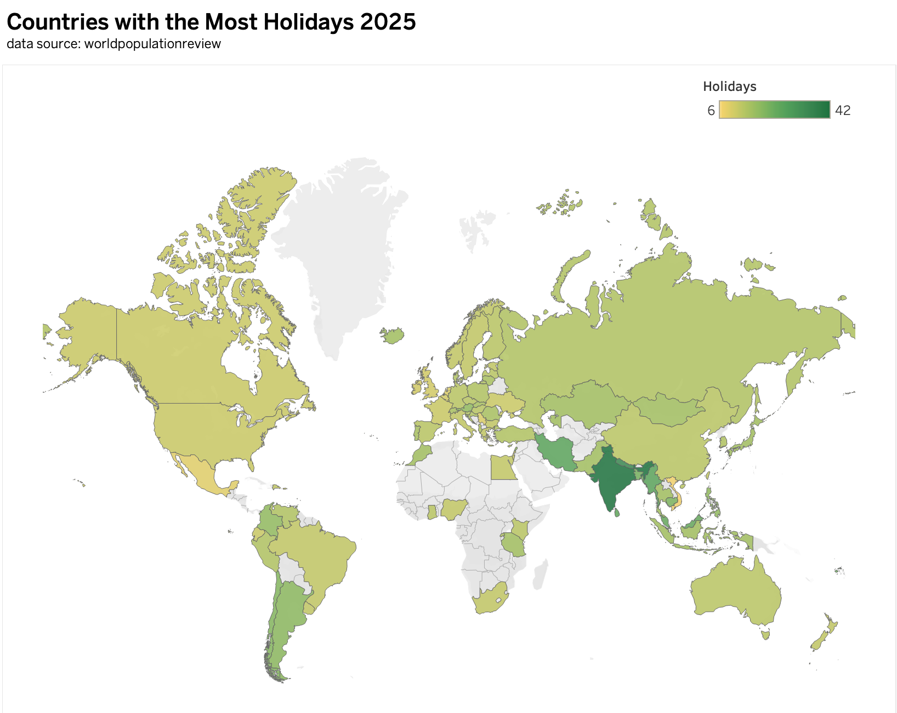

| [home page](https://cmustudent.github.io/tswd-portfolio-templates/) | [data viz examples](dataviz-examples) | [critique by design](critique-by-design) | [final project I](final-project-part-one) | [final project II](final-project-part-two) | [final project III](final-project-part-three) |

# Critique-By-Design

## Step one: the visualization

I chose this visualization because it allows the audience to quickly and easily compare public holidays across countries. The map format is intuitive, and the interactive features let users access detailed information without sifting through raw data. It effectively communicates differences at a glance.

[Data_Source](https://worldpopulationreview.com/country-rankings/countries-with-the-most-holidays)

## Step two: the critique

Strengths:
1. Appropriate visualization type: Using a map allows viewers to quickly understand the geographic distribution of public holidays.
2. Effective use of color intensity: Darker shades immediately draw attention to countries with more holidays (e.g., India), highlighting key differences at a glance.
3. Interactive feature: Hovering over a country displays its name and exact number of holidays, providing detailed information without cluttering the map.

Areas for improvement:
1. Legend design: The current legend uses discrete increments of 5 (5, 10, …, 40, 45), but many countries do not fall exactly on these multiples. This can be misleading.
2. Tooltip: Adding more information of the holidays and the rank.

## Step three: Sketch a solution

To address the issue with the legend, I would redesign the visualization by replacing the discrete legend with a continuous color gradient. This would ensure that every country’s number of public holidays is represented more precisely, and the audience would have an easier time interpreting subtle differences across countries.
To address the issue with the legend, I would redesign the visualization by replacing the discrete legend with a continuous color gradient. This would ensure that every country’s number of public holidays is represented more precisely, and the audience would have an easier time interpreting subtle differences across countries.

In addition, I would enrich the tooltip content. Besides showing the country name and total number of holidays, the tooltip would also include short explanatory notes or contextual details. For example: Germany — Varies from 10–13 depending on the state. This additional information would make the visualization not only more accurate, but also more informative for audiences interested in cultural or policy differences.

Overall, the revised design would maintain the strengths of the original (geographic clarity and interactivity) while improving both the accuracy of the legend and the depth of contextual insights available to users.

## Step four: Test the solution

Feedback from Group Members:

1. The title “Countries with the Most Holidays 2025” may be misleading, since the dataset does not include every country in the world. A more accurate and rigorous title should be used.
2. The data source could be improved by including a direct link, so that readers who want to access the dataset themselves can do so easily.
3. Many African countries are shown in gray because of missing data, but the legend does not explain this. A clear note or legend entry should be added to indicate that gray areas mean "No data available".

Feedback from BIDa Classmates:
1. The layout of the map could be adjusted. Most world maps place Europe and Asia on the left, with the Americas and Africa on the right. Reorganizing the map in this way would make the visualization feel more familiar and consistent with common map conventions.
2. While the map’s color gradient reflects the overall distribution, the audience cannot easily see the exact number of holidays for each country. To address this, the visualization can either highlight the Top 5 and Bottom 5 countries with their specific values directly on the map, or include a supplementary bar chart/ranking table alongside the map for clearer comparison.

## Step five: build the solution

Final Solution: The final visualization combines a choropleth map with a supplementary bar chart.
1. The map uses a consistent gradient color scheme to show the overall distribution of holiday counts across countries. Missing data is represented in gray, with a clear legend entry indicating “No data available.”
2. To address the map’s limitation in conveying precise values, a Top 5 / Bottom 5 bar chart is placed to the right. This chart highlights the five countries with the most holidays and the five with the fewest, using the same gradient color scale as the map to ensure consistency and readability.
3. An interactive highlight action allows the audience to click on a country in the map to automatically highlight the same country in the bar chart (and vice versa), creating a seamless link between the two views.

<noscript></noscript><object class='tableauViz'  style='display:none;'><param name='host_url' value='https%3A%2F%2Fpublic.tableau.com%2F' /> <param name='embed_code_version' value='3' /> <param name='site_root' value='' /><param name='name' value='makeoverMonday_17582312643500&#47;Dashboard2' /><param name='tabs' value='no' /><param name='toolbar' value='yes' /><param name='static_image' value='https:&#47;&#47;public.tableau.com&#47;static&#47;images&#47;ma&#47;makeoverMonday_17582312643500&#47;Dashboard2&#47;1.png' /> <param name='animate_transition' value='yes' /><param name='display_static_image' value='yes' /><param name='display_spinner' value='yes' /><param name='display_overlay' value='yes' /><param name='display_count' value='yes' /><param name='language' value='zh-CN' /><param name='filter' value='publish=yes' /></object>
                

## References
[Data Visualization Effectiveness Profile](https://www.perceptualedge.com/articles/visual_business_intelligence/data_visualization_effectiveness_profile.pdf)

## AI acknowledgements
The interactive link between the two visualizations (map and Top/Bottom 5 bar chart) was implemented following guidance I received from AI (ChatGPT). I applied the suggested steps to create the highlight action and integrate the two views.

