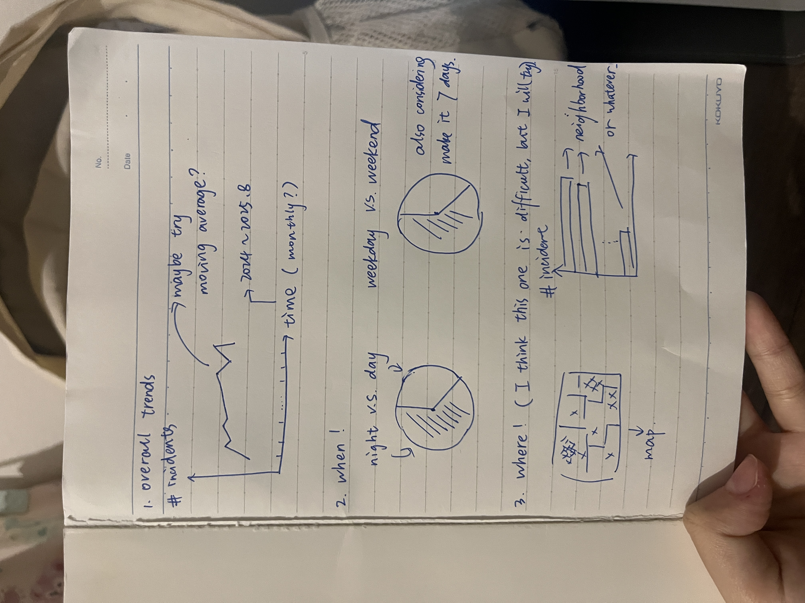

| [home page](https://cmustudent.github.io/tswd-portfolio-templates/) | [data viz examples](dataviz-examples) | [critique by design](critique-by-design) | [final project I](final-project-part-one) | [final project II](final-project-part-two) | [final project III](final-project-part-three) |

# Outline
 
For my final project, I plan to analyze crime incident data from Pennsylvania to uncover patterns across time, location, and offense type. This dataset provides detailed attributes such as report numbers, dates and times, geographic coordinates, offense categories, and neighborhoods. By visualizing these attributes, I want to highlight when crimes are most likely to occur, where they concentrate, and what types of offenses dominate in different contexts.

The goal of this project is not only to show descriptive trends but also to tell a compelling story about public safety. Crime impacts communities differently across neighborhoods, time periods, and categories. By creating a structured narrative, I want to move from a “big picture” overview into more focused insights—identifying hotspots, risky time windows, and offense categories that stand out. These insights could ultimately support better resource allocation, community awareness, and policy discussions.

1.Overall trends
I plan to show the monthly trend of crime incidents in Pennsylvania from January 2024 to August 2025. To make the curve smoother and easier to interpret, I may apply a moving average. This visualization will allow us to see whether crime incidents are generally increasing, decreasing, or remaining stable. By identifying these long-term patterns, we can evaluate whether certain policies, community initiatives, or policing efforts have had an effect on crime trends.

2. When do crimes happen
I will use two pie charts to show the distribution of crimes between day vs. night and weekdays vs. weekends. This analysis highlights the time periods when crimes are most likely to occur. Such insights can help law enforcement agencies allocate patrols more efficiently and help residents stay more alert during high-risk periods.

3.Where do crimes happen
First, I will attempt to create a crime density map using the XCOORD and YCOORD fields to visualize crime intensity across locations. If this proves too complex, I may adjust the method. Additionally, I plan to use a ranking bar chart to show the top 10 neighborhoods with the highest number of crime incidents. These visualizations will identify geographic hotspots of crime. By knowing where crime concentrates, city officials and communities can prioritize resources, improve urban planning, and target specific neighborhoods with preventive strategies.

4. What type of crimes happen
I will show the distribution of different crime types, using either NIBRS_Offense_Category or NIBRS_Crime_Against (Person, Property, Society). This could be visualized through a pie chart for proportions or a stacked bar chart for comparative analysis. This breakdown helps clarify which types of crimes dominate the landscape—whether crimes against people, property, or society. Such knowledge can help policymakers and the public better understand the nature of the threat and where to focus prevention efforts.

5. Interaction
Finally, I am considering combining spatial data with crime categories to see if certain crimes, such as property crimes, are more likely to happen in specific neighborhoods. This integrated perspective provides deeper insights into how crime types vary across locations. It can reveal underlying social or economic patterns and support tailored interventions at the community level.

## Initial sketches

# The data
The dataset covers reported crime incidents from January 2024 through August 2025 in Pittsburgh and includes detailed information such as the type of offense, the time and date of occurrence, geographic coordinates (XCOORD and YCOORD), and the classification of crimes as offenses against.

This dataset is particularly valuable because it not only records the overall number of incidents but also provides granular details that allow for multiple dimensions of analysis. For example, the temporal fields (date and time) can be used to identify seasonal and hourly crime patterns, while the geographic coordinates can be used to map crime density and highlight high-risk neighborhoods. The offense classification fields (NIBRS_Offense_Category, NIBRS_Offense_Type, and NIBRS_Crime_Against) enable comparisons between different types of crimes, such as violent vs. property crimes.

For this project, I plan to use the dataset to create visualizations that answer several key questions: How have crime trends changed over time? When are crimes most likely to occur? Where are the geographic hotspots? And what types of crimes dominate the landscape? By combining these perspectives, the project aims to tell a cohesive story about crime dynamics in Pennsylvania and to suggest potential insights for both policymakers and the general public.

> A link to the publicly-accessible datasets you plan on using, or a link to a copy of the data you've uploaded to your Github repository, Box account or other publicly-accessible location. Using a datasource that is already publicly accessible is highly encouraged.  If you anticipate using a data source other than something that would be publicly available please talk to me first. 

| Name | URL | Description |
|------|-----|-------------|
|[2024-August 2025 Monthly Criminal Activity Dataset](https://data.wprdc.org/dataset/monthly-criminal-activity-dashboard/resource/bd41992a-987a-4cca-8798-fbe1cd946b07)|  https://data.wprdc.org/dataset/65e69ee3-93b2-4f7a-b9cb-8ce977f15d9a/resource/bd41992a-987a-4cca-8798-fbe1cd946b07/download/mcad_2024_aug2025.xlsx|This dataset includes Pittsburgh Bureau of Police crime incidents. The Monthly Criminal Activity Dashboard can utilize this data: [Monthly Criminal Activity] Dashboard(eyJrIjoiM2FiNWUxMDUtY2MyMS00NWY2LTllZDEtZWY2OWM0NWM2ZWIyIiwidCI6ImY1ZjQ3OTE3LWM5MDQtNDM2OC05MTIwLWQzMjdjZjE3NTU5MSJ9). This data follows the National Incident-Based Reporting System (NIBRS) reporting standard. More detail can be found here: https://www.fbi.gov/how-we-can-help-you/more-fbi-services-and-information/ucr/nibrs Similar data was previously published at Police Incident Blotter (Archive): https://data.wprdc.org/dataset/uniform-crime-reporting-data|
|      |     |             |
|      |     |             |

# Method and medium
> In a few sentences, you should document how you plan on completing your final project. 

Text here...

## References
_List any references you used here._

## AI acknowledgements
_If you used AI to help you complete this assignment (within the parameters of the instruction and course guidelines), detail your use of AI for this assignment here._
